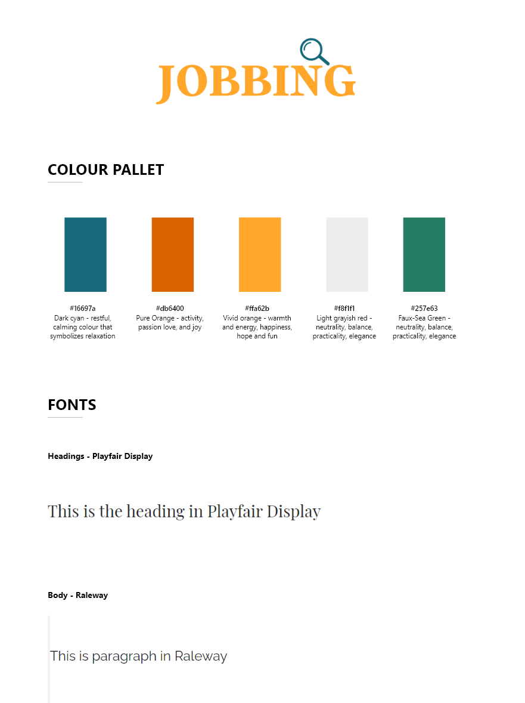

# JOBBING

## Project Overview

Jobbing is an employment website targeting both jobseekers and employers. Our mission is to connect people with new opportunities and give them a chance to change their careers & lifestyle forever. With access to more then 100 available jobs jobseekers can search & save jobs. On the other side, employers can post new opportunities in their company, edit or delete them.

### **The live site can be viewed [here](https://jobbing-hiring-app.herokuapp.com/)**

# **Table Of Contents:**

- **UX**
  - Research and Analysis Phase
    - Business decision, long-term goals
    - User Stories
  - Design Phase
    - Sitemap
    - Colour pallet & Typography
    - Wireframes

# **UX**

The website is designed with simplicity & effectivness in mind, allowing users to easily grasp the website content. Primarily focus for a jobseeker is to easily navigate through the website to find a desired job. In the other hand, various CTA throughout navigation and homepage are allowing employers to post a job in minutes. From the support standpoint both user types have access to FAQ's & contacts us section for any queries they might have.

# **Research and Analysis Phase**

## **Brainstorming Ideas & User Stories**

One of the main reasons why I selected this business sector is to achive the CRUD functionality. By allowing users to manipulate the data in front of them. Also, to narrow down the funcionality I decided to enable jobseekers to search, save & delete saved jobs, and employers to post, edit & delete jobs posted by them.

**Long term goals:**

- Ultimately, the scope for this business is to allow job applications for jobseekers, and notifications of subbmited aplications to employers. This would include CV & cover letter upload, additional details subbmited by form and ability to contact the employer via message center
- Enable employers to view jobseeker profile and message them.
- Allowing jobseekers to compare jobs & mark them as checked, applied, not suitable.
- Include an online chat to improve the support throughout the user journey

### **User Stories**

As a **Jobseeker** , I want to:

i. Easily find posted jobs which are relevant to me. Save the jobs which I think are suitable for me.

ii. Have access to my profile setting and ability to edit/change them.

iii. Have a solid support channels throught the website journey.

iv. Have a deatailed information about each job presented to me - job title, description, location, salary etc.

As a **Employer** , I want to:

i. Have access to post all new opportunities that my arise in my company.

ii. Have access to edit, view & delete the job once posted.

iii. Have the ability to edit my company details should they change.

# **Design Phase**

## **Sitemap**

Sitemap creation allowed me to brainstorm webiste structure and decide which pages will be included - view [here](documentation/Site-map.pdf).

## **Colour palette & Typography**

Colour pallet was determined by conducting competitor analysis and investigating the most commonly used colours for the selected business.
Playfair Display is the selected font for all the headings with sans-serif as a fallback. For the paragraphs and the rest of body text raleway is the used font with sans-serif as a fallback.

## **Wireframes**

All wireframes were created in Adobe XD. Each one is detailed which allowed me to make the development process easier and shift the focus towards coding rather then re-thinking design aspect while coding.
Wireframes are saved in PDF file type and can be accessed [here](documentation/wireframes).

# **Features & Pages**

The website is consists of 8 unique pages:

- Homepage
- Contact Us
- Find a Job page
- Login page
- Register page
- Profile page
- Post a job page
- Edit a job page

<ins>_Navigation_</ins>

Navigation bar consists of company logo, navigation links & post a job button. Availablity of links changes depending on user session. If user is logged out they have options to login, register, find a job & contact us.
If user is logged in - employer or jobseeker, they can look for jobs, access their profile, contact us, logout & post a job (employer only).

Mobile version navigation has company logo and humburger menu which has same structure as large navigation.

<ins>_Footer_</ins>

The top part of footer has a company logo, the below part has navigation links, copyiright & social links.

<ins>_Homepage_</ins>

The hompage is divided into four sections:

- _Hero Section_: Which consists of background image, search bar & CTA to post a job.
- _Popular Categoires_: This section offers three popular job categories, allowing the user to search for a specific job type.
- _About Us_: Which consists of background video, about company text & USP's (unique selling points). This section servs as a trust builder.
- _FAQ's_: This section has some of most important asnwered questions, allowing decrease in customer queries.

<ins>_Contact Us_</ins>

Contact us page consist of contact form, company contact details & google map showcasing company location.
After user submits the contact form, it uses Emailjs integration to send a message as an email template. Also, the "Message Sent" appears after form submission to inform the user.

<ins>_Find a Job Page_</ins>

Fnd a job page is divided to three sections:

- Search bar - users can search for a desired job via location, job type, company name etc.
- Popular categories - This section offers three popular job categories, allowing the user to search for specific job type.
- Job listing - this section shows all listed jobs, highlighting job title, company, contract type, company address, salary & one line of description. From here users can select "See More" button to view full job description. Also, as a jobseeker users can save favourite jobs which will show on their profile page.
  Additionally job listing shows how many jobs is there in total & allows only three jobs per page. If users searches for jobs through search function or by category "See all Jobs" filter shows allowing them to return to the full job listing.

<ins>_Log in / Register Pages_</ins>

Log in page consist of form allowing the user to log in to their account, also it points the user towards register page if they are not registered.

Register page consists of form asking for user details, form changes depending on user type registration - from here users can select employer or jobseeker registration. Below the form, CTA points towards log in page if the user is an account owner.

<ins>_Profile Page_</ins>

Profile page displays user details at the top - for jobseekers those are Name & Email address, employers can see Name, Email address, Company Name & Address.
Underneath user details, depending on the user type user can see either saved jobs / posted jobs. Jobseekers have access to remove saved jobs, and emoloyers can edit their own posted jobs and remove them.

<ins>_Post / Edit Job Page_</ins>

Post a job page consist of form asking the employer to submit all relevant job information which becomes visible on the job listing page & their profile page after form submission.

Edit job - only accessible from employer profile page shows same form format as Post a job page, but it pre-fills the existing job details allowing the user to make changes to already existing job.
