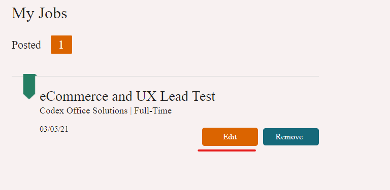
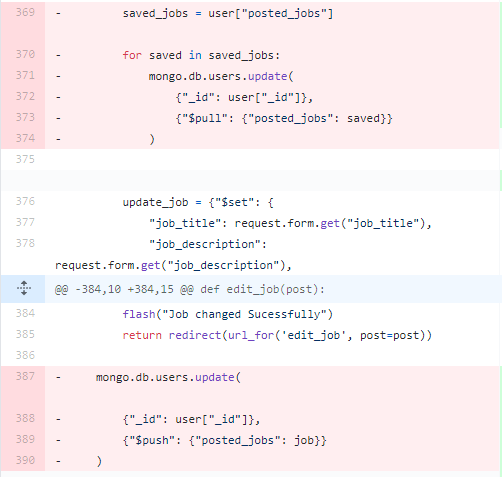

# JOBBING

## Project Overview

Jobbing is an employment website targeting both jobseekers and employers. Our mission is to connect people with new opportunities and give them a chance to change their careers & lifestyle forever. With access to more then, 100 available jobs jobseekers can search & save jobs. On the other side, employers can post new opportunities in their company, edit or delete them.

### **The live site can be viewed [here](https://jobbing-hiring-app.herokuapp.com/)**.

To log in as a jobseeker please use the following log in credentails:

Email address: test@gmail.com

Password: Hello123

To log in as a employer please use the following log in credentails:

Email address: test-employer@gmail.com

Password: Hello123

# **Table Of Contents:**

- **UX**

  - Research and Analysis Phase
    - Business decision, long-term goals
    - User Stories
  - Design Phase

    - Sitemap
    - Colour pallet & Typography
    - Wireframes

  - **Features & Layout**

    - Homepage
    - Contact Us
    - Find a Job page
    - Login page
    - Register page
    - Profile page
    - Post a job page
    - Edit a job page

  - **Acknowledgements**

- **Technologies & Resources Used**

  - Languages Used
  - Frameworks & Processors
  - Workspace, version control and Repository storage
  - Integrations
  - Resources & Media

- **Testing & Deployment**
  - Validation & API testing
  - Testing Users Stories
  - Database Accessing Test
  - Testing Responsiveness
  - Bugs
  - Deployment

# **UX**

The website is designed with simplicity & effectiveness in mind, allowing users to grasp the website content quickly. Primarily focus for a jobseeker is to navigate through the website to find the desired job quickly. On the other hand, various CTA throughout navigation and homepage allow employers to post a job in minutes. From the support standpoint, both user types have access to FAQ's & the contact us section for any queries they might have.

# **Research and Analysis Phase**

## **Brainstorming Ideas & User Stories**

One of the main reasons why I selected this business sector is to achieve the CRUD functionality by allowing users to manipulate the data in front of them. Also, to narrow down the functionality, I decided to enable jobseekers to search, save & delete saved jobs, and employers to post, edit & delete jobs posted by them.

**Long term goals:**

- Ultimately, the scope for this business is to allow job applications for jobseekers, and notifications of submitted applications to employers. This would include CV & cover letter upload, additional details submitted by form and the ability to contact the employer via the message centre.
- Enable employers to view jobseeker profile and message them.
- Allowing jobseekers to compare jobs & mark them as checked, applied, not suitable.
- Include an online chat to improve the support throughout the user journey

### **User Stories**

As a **Jobseeker** , I want to:

i. Easily find posted jobs that are relevant to me. Save the jobs which I think are suitable for me.

ii. Have access to my profile information and the ability to edit them.

iii. Have solid support channels throughout the website journey.

iv. Have deatailed information about each job presented to me - job title, description, location, salary etc.

As a **Employer**, I want to:

i. Have access to post all new opportunities that may arise in my company.

ii. Have access to edit, view & delete the job once posted.

iii. Have the ability to edit my profile information.

# **Design Phase**

## **Sitemap**

Sitemap creation allowed me to brainstorm website structure and decide which pages will be included - view [here](documentation/Site-map.pdf).

## **Colour palette & Typography**

Colour palette was determined by conducting competitor analysis and investigating the most commonly used colours for the selected business.

## **Wireframes**

All wireframes were created in Adobe XD. Each one is detailed, which allowed me to make the development process more manageable and shift the focus towards coding rather than rethinking the design aspect. Wireframes are saved in PDF file type and can be accessed [here](documentation/wireframes).

# **Features & Pages**

The website consists of 8 unique pages:

- Homepage
- Contact Us
- Find a Job page
- Login page
- Register page
- Profile page
- Post a job page
- Edit a job page

<ins>_Navigation_</ins>

The navigation bar consists of the company logo, navigation links & post a job button. Availability of links changes depending on the user session. If users are logged out, they can log in, register, find a job, & contact us. If the user is logged in - employer or jobseeker, they can look for jobs, access their profile, contact us, log out & post a job (employer only).

Mobile version navigation has a company logo and hamburger menu with the same structure as large navigation.navigation.

<ins>_Footer_</ins>

The top part of the footer has a company logo, and the below part has navigation links, copyright & social links.

<ins>_Homepage_</ins>

The homepage is divided into four sections:

- _Hero Section_: This consists of the background image, search bar & CTA to post a job.
- _Popular Categories_: This section offers three popular job categories, allowing the user to search for jobs within the selected category.
- _About Us_: This consists of background video, about company text & USP's (unique selling points). This section serves as a trust builder.
- _FAQ's_: This section has some of the most important questions, allowing a decrease in customer queries.

<ins>_Contact Us_</ins>

Contact us page consist of the contact form, company contact details & google map showcasing company location. After the user submits the contact form, it uses EmailJs integration to send a message as an email template. Also, the "Message Sent" appears after form submission to inform the user.

<ins>_Find a Job Page_</ins>

Find a job page is divided into three sections:

- Search bar - users can search for the desired job via location, job type, company name etc.
- Popular categories - This section offers three popular job categories, allowing the user to search for a specific job type.
- Job listing - this section shows all listed jobs, highlighting job title, company, contract type, company address, salary & one line of description. From here, users can select "See More" button to view the full job description. Also, as a jobseeker, users can save favourite jobs, which will show on their profile page.

Additionally, job listing indicates how many jobs are there in total & allows only three jobs per page. If users searches for jobs through the search function or by category "See all Jobs" filter shows allowing them to return to the full job listing.

<ins>_Log in / Register Pages_</ins>

Log in page consist of a form allowing the user to log in to their account. Also, it points the user towards the registration page if they are not registered.

Register page consists of a form asking for user details, form changes depending on user type registration - from here, users can select employer or jobseeker registration. Below the form, CTA points towards the log in page if the user is an account owner.

<ins>_Profile Page_</ins>

The profile page displays user details at the top - for jobseekers, Name & Email address, employers can see Name, Email address, Company Name & Address. Underneath user details, depending on the user type user can see either saved jobs / posted jobs. Jobseekers have access to remove saved jobs, and employers can edit their own posted jobs and remove them.

<ins>_Post / Edit Job Page_</ins>

Post a job page consist of a form asking the employer to submit all relevant job information which becomes visible on the job listing page & their profile page after form submission.

Edit job - only accessible from employer profile page shows the same format as Post a job page, but it pre-fills the existing job details, allowing the user to make changes to existing jobs.

# **Technologies & Resources Used**

## **Languages & Database Used**

 **HTML5**

 **CSS3**

 **JavaScript**

 **Python**

## **Database**

 **MongoDB**

## **Frameworks & Processors**

 **Flask** - Flask was used to render HTML pages with jinja templating and allow database connection with MongoDB.

 **SCSS** - scss was used to enable quicker and more efficient coding.

 **JQuery** - jQuery was used as an excellent addition to JavaScript to enable efficient coding and more straightforward solutions to the problem.

 **Materialize** - Materialize framework was used only for navigation & form sections.

## **Workspace, version control and Repository storage**

 **GitPod** - All code is written in Gitpod cloud environment, committed and pushed to GitHub.

 **Git** - Distributed Version Control tool to store versions of files and track changes.

 **GitHub** - A cloud-based hosting.

 **Heroku** - A cloud-based platform, allowing developers to build, run and operate applications. Heroku has automatic deployment enabled and it's connected to Github. With each commit, it automatically applies changes to Heroku.

## **Integrations**

- [Google Maps API](https://developers.google.com/maps/documentation/javascript/overview)

The Google Maps API was used to showcase company location on the contact page.

- [EmailJS](https://www.emailjs.com/)

EmailJs has been used for the contact us form. All messages are using one template set up in the software. Each of the fields is sent through as a parameter and sent directly to my email address.

## **Resources & Media**

 **Font Awesome** - Font Awesome was used for all icons on the page enabling usage of after and before pseudo-elements with ease.

- **Canva** was used for all the imagery on the page.
- **Adobe XD** - used for creating wireframes.
- **Stack Overflow** - General resource for code and problem solving
- **W3 School** - General resource for code and problem solving

# **Testing & Deployment**

## **Validation & API testing**

- ### HTML Validation

I have used [W3C Markup validator](https://validator.w3.org/) to check all HTML pages for possible errors.
The below are highlighted unique issues with each page:

The validator returned errors for every page highlighting issues around Jinja template language. After some research and consulting with my mentor I've decided to overlook this error.

### <ins>Homepage</ins>

Validator returned errors for duplicate ID's on the form element. I've decided to leave the ID's the same way as the element is not visible on the page simultaneously - depending on the screen size, it hides each dynamically.

### <ins>Contact Us Page</ins>

Validator returned errors surrounding validate attribute on input elements.

I've realized that instead of including validate as a class, I included it as a standalone attribute. All the validates are now part of the class attribute.

### <ins>Edit Job Page</ins>

Issue 1 - Validator returned errors surrounding selected attribute on option element and textarea

To overcome this issue, I have included the selected class attribute of an element instead of leaving it as standalone.

Issue 2 - Pattern attribute not allowed on text area element.

I've removed the pattern attribute from the text area.

### <ins>Find A Job Page</ins>

The validator returned a warning for page missing heading elements h2-h6. Due to the way page is designed and developed, I didn't need extra headings.

### <ins>Post A Job Page</ins>

Validator returned errors surrounding selected attribute on option element and textarea. Also, pattern attribute is not allowed with textarea element

I have included selected to a class attribute and removed validate & pattern attributes from textarea element to overcome this issue.

### <ins>Profile Page</ins>

Validator returned warning for empty heading element, required not allowed on disabled input elements.

Some headings serve as a placeholder and are populated dynamically - others were used by mistake instead of the icon element. Required is removed from disabled input elements.

### <ins>Register Page</ins>

Validator returned issue regarding anchor tag being descendant of the button element.
I refactored both HTML and CSS to rectify the problem.

- ### CSS Validation

Before Validating the CSS, I used [Autoprefixer](https://autoprefixer.github.io/) to add prefixes to all CSS properties, which are not supported by all browser. I have used flex property for most of the elements, it was beneficial to add prefixes to achieve the correct site rendering across browsers.

I have used [W3C CSS Validator](https://jigsaw.w3.org/css-validator/) to validate the CSS file. The CSS syntax was correct after the first try.

- ### Javascript Validation

I have used [JSHint]("https://jshint.com/") to validate script.

Validator returned 41 warnings, all highlighting the use of ES6 syntax. After doing some research, I have decided to overlook the warnings.

### API Testing

- #### [EmailJS API](https://www.emailjs.com/)

The contact us form is sent through to my email address using EmailJS integration.
The test is demonstrated below:

Filling in the form

Checking the form submission success in the inbox

- #### [Google map API](https://developers.google.com/maps/documentation/javascript/overview)

Google maps are used for company location on Contact Us page. I've included both the development and Heroku URL to the referrer list on the Google API side to allow correct rendering.

Checking city map rendering

## **Testing User Stories**

As a **Jobseeker** , I want to:

_i. Easily find posted jobs that are relevant to me. Save the jobs which I think are suitable for me_ - this can be achieved by visiting find a job page which shows all listed jobs. Also, it allows the user to save a job to their profile.

_ii. Have access to my profile information and the ability to edit them_ - user can read & update their name within the profile page.

_iii. Have solid support channels throughout the website journey_ - FAQ's on the homepage serve as a support section, also user can use the contact us page to submit the message or contact us directly via email or phone no.

_iv. Have detailed information about each job presented to me - job title, description, location, salary etc._ - to see detailed information about each job user has access to view full job post within job listing.

As a **Employer** , I want to:

_i. Have access to post all new opportunities that may arise in my company_ - to achieve this, the employer has access to post a job section. This can be found in top navigation across the whole website. From here, user can submit all details about the job they are trying to post.

_ii. Have access to edit, view & delete the job once posted_ - users can achieve this from their profile page, where each posted job is listed together with the edit & remove button.

_iii. Have the ability to edit my profile information_ - user can read & update their name within the profile page.

## **Database Accessing Test**

The whole website is built around two collections, "users" & "jobs". The following functionality will be tested by each page (only database accessing points)

## Homepage

- Searching for jobs with search bar by using keywords: eCommerce, Dublin & Marketing.
  eCommerce returned one job post by matching the words within the job records.

Dublin & Marketing both returned accurate results. Searching redirect the user to find a job page.

- Searching for the job by category

All categories returned correct results. The example below shows Sales category jobs.

## Find A Job

- Searching for jobs with search bar by using keywords: eCommerce, Dublin & Marketing.
  eCommerce returned one job post by matching the words within the job records.

  All performed searches returned the correct result and redirected to the same page.

- Searching by category worked correctly for all three categories.

- Save a job feature - only available for jobseeker. I've tested the access to it as an un-logged user and employer, and the option is correctly hidden.

For this example, I'm taking the top listed job. Currently, there are no saved jobs within the "saved_jobs" file.

The job was saved successfully from the first try.

Here is the database side showcasing the saved job.

If the user attempts to save the same job, they are presented with a job already saved message and redirected to the same page.

## My Profile

- Changing user's name attempt. I've tested the feature for both jobseeker and employer.

Screenshot of the record before the change (jobseeker only)

Result after applying the change.

- Removing saved job from the list (jobseeker)

For this example, I will remove previously saved job

The job was successfully removed from the first try

- Removing / editing posted job from the list (employer)

Removing a job from posted job list gets removed from jobs collection and posted jobs available within the user record. For this example, I will use the same job from before.
If the user edits the job, the records are updated in both collections as well.

Editing a job:

The editing was successful from the first try, the job title changed, which is visible at the first line.

Confirmation on find a job & profile pages

Removing a job:

For this example, I'm using the same job. When the record is removed it should disappear from profile & job lists.

It's visible that the total job count went from 7 to 6 and that there is no eCommerce and UX Lead job at the top of the list.

## Post A Job Page

When the user posts a job, it should automatically appear on the top of the job listing and within the profile page.

I will be using the same user as above, which currently has 0 posted jobs.

Posting a job was successful from the first attempt. It's visible that the total job count went from 6 back to 7 and that the same job now appears on both profile and find a job page.

## Register Page

The below test showcases jobseeker registration. Below it's visible the total number of users set up in the database and their type , which can be determined by "is_employer" & "is_jobseeker" files.

The registration was successful with the first attempt. The user is now visible in the database as well.

Employer registration was successful, saving the user to the database correctly.

## Sign In

Login attempt with correct details was successfully redirecting the user to the profile page. If the user enters incorrect details, it redirects them to the same page and shows an invalid password.

## **Testing responsiveness**

I've performed a responsiveness test across various screen sizes. All the pages are fully responsive down to 320px screen width.

## **Fixed Bugs**

1. Saved jobs showing across all users bug.
   If the user would save a job it would show across different users as well beacuse of the distinct method

To overcome this issues I looked up saved jobs only from the user saved in a session and passed the varaible to a template.

2. When user edits the job it doesn't saves is to posted_job file in user collection, it only does it in job collection. It also adds duplicate jobs.

To overcome this issue I've passed a job id varaiable upon form post. Firstly I've removed the item from posted_jobs array by looking at specific Id. Then I've implemented a check to see if the job was already saved - if it is skip the saving, if not add the job to array.

3. When deleting the job from the profile page, it always removes the last job in the list. This created issues when trying to delete a specific job beacuse it would always delete incorrect one. The method used to delete a job was a POST method with the form.

To rectify the issues, I have removed the form from HTML and replaced it with anchor tah which passes the selected job id.
Then I seperated delete job function to two (one for employer & one for jobseeker) - this allowed me to read correct varaibles.

The funcionality stayed the same, just passing the varaible from the url opposed to reading it from the form request.

4. If employer would deleted a job which the jobseeker had saved under their profile it would remain there, which resulted in erorr when trying to deletd a job as the record doesn't actually exist any more.

To overcome the issues, I've included a fucionality when employer deletes the job it removes it from all existing records ensuring it never shows again.

## **Outstanding Bugs**

Two flash messages shows on the find a job page when user saves the job. I only wanted to show a message above job listing section but avoid repiting flash message element across every page - curerntly it only sits on base.html and find_job.html

## **Deployment**

The source code for this site is in GitHub. Heroku was used to deploy the site.

### <ins>Github</ins>

To clone the code from GitHub Repo:

- On GitHub, navigate to the main page of the repository.

- Above the list of files, select Code:

To clone the repository using HTTPS, click HTTPS under "Clone".

Open Git Bash.

Change the current working directory to the location where you would like to save the clone directory

Type git clone, and then paste the URL you copied earlier: $ git clone https://github.com/Boki136/Jobbing.git

Press Return to create your local clone.

Create your own "env.py" file to store variables, and ensure the file is listed in .gitignore file to ensure they are not displayed publicly.

- Import os
- os.environ.setdefault("IP", "enter value")
- os.environ.setdefault("PORT", "enter value")
- os.environ.setdefault("SECRET_KEY", "enter value")
- os.environ.setdefault("MONGO_URI", "enter value")
- os.environ.setdefault("MONGO_DBNAME", "enter value")

### <ins>Deployment to Heroku</ins>

- Setup files that Heroku needs to connect correctly:

requirements.txt: this files list all the dependencies

Procfile: Heroku looks to know which file runs the app (delete the blank line at the bottom of Procfile as it may cause problems when running on Heroku).

- Setup Process

Go to Heroku, once logged into your dashboard, select ‘Create new app’:

Create app name (name must be unique, I would recommend using minus symbol instead of spaces.
Choose the closest region to you & create the app.

- Setup automatic deployment from your GitHub repository:

Navigate to the Deploy tab within Heroku, select GitHub as deployment method.

Ensure your GitHub profile is displayed and search for the desired repository. If the wanted repo is visible in the list, select "Connect".

Click on the ‘Settings' tab:

Then select ‘Reveal Config Vars’

Enter the variables (from the env.py) file to tell Heroku which variables are required securely:

- IP
- PORT
- MONGO_DBNAME
- MONGO_URI
- SECRET_KEY

Back in your Gitpod bash, commit two new files (requirements.txt and Profile) and push to GitHub.

Back in Heroku, under the Deployment tab, you can now safely 'Enable Automatic Deployment', then 'Deploy Branch'.
The process should take a minute or two. After it's done, you will get the confirmation "your app is successfully deployed."

## **Acknowledgements**

- Inspiration and guidance while building the app was taken from Code Institue Task Manager Mini-Project by Tim Nelson.
- Huge thanks to Narender Singh for the support and guidance I received during this project.
- Thanks to the community on Slack and excellent tutor support so far. I've experienced a Gitpod bug during the development process, which somewhat slowed me down, but with tremendous help and support, we managed to find the alternative.
- Thanks to Code Insitute for brilliant & well-organised content.
