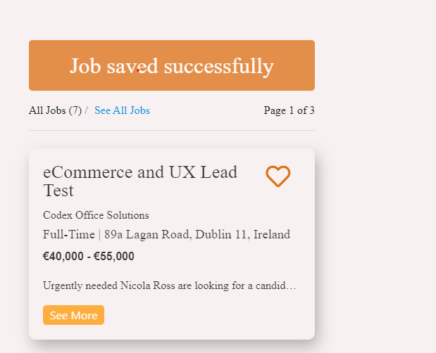

# JOBBING

## Project Overview

Jobbing is an employment website targeting both jobseekers and employers. Our mission is to connect people with new opportunities and give them a chance to change their careers & lifestyle forever. With access to more then 100 available jobs jobseekers can search & save jobs. On the other side, employers can post new opportunities in their company, edit or delete them.

### **The live site can be viewed [here](https://jobbing-hiring-app.herokuapp.com/)**

# **Table Of Contents:**

- **UX**

  - Research and Analysis Phase
    - Business decision, long-term goals
    - User Stories
  - Design Phase

    - Sitemap
    - Colour pallet & Typography
    - Wireframes

  - **Features & Layout**

    - Homepage
    - Contact Us
    - Find a Job page
    - Login page
    - Register page
    - Profile page
    - Post a job page
    - Edit a job page

- **Technologies & Resources Used**

  - Languages Used
  - Frameworks & Processors
  - Workspace, version control and Repository storage
  - Integrations
  - Resources & Media

- **Testing & Deployment**
  - Validation & API testing
  - Testing Users Stories
  - Database Accessing Test

# **UX**

The website is designed with simplicity & effectivness in mind, allowing users to easily grasp the website content. Primarily focus for a jobseeker is to easily navigate through the website to find a desired job. In the other hand, various CTA throughout navigation and homepage are allowing employers to post a job in minutes. From the support standpoint both user types have access to FAQ's & contacts us section for any queries they might have.

# **Research and Analysis Phase**

## **Brainstorming Ideas & User Stories**

One of the main reasons why I selected this business sector is to achive the CRUD functionality. By allowing users to manipulate the data in front of them. Also, to narrow down the funcionality I decided to enable jobseekers to search, save & delete saved jobs, and employers to post, edit & delete jobs posted by them.

**Long term goals:**

- Ultimately, the scope for this business is to allow job applications for jobseekers, and notifications of subbmited aplications to employers. This would include CV & cover letter upload, additional details subbmited by form and ability to contact the employer via message center
- Enable employers to view jobseeker profile and message them.
- Allowing jobseekers to compare jobs & mark them as checked, applied, not suitable.
- Include an online chat to improve the support throughout the user journey

### **User Stories**

As a **Jobseeker** , I want to:

i. Easily find posted jobs which are relevant to me. Save the jobs which I think are suitable for me.

ii. Have access to my profile information and ability to edit them.

iii. Have a solid support channels throught the website journey.

iv. Have a deatailed information about each job presented to me - job title, description, location, salary etc.

As a **Employer** , I want to:

i. Have access to post all new opportunities that may arise in my company.

ii. Have access to edit, view & delete the job once posted.

iii. Have the ability to edit my profile information.

# **Design Phase**

## **Sitemap**

Sitemap creation allowed me to brainstorm webiste structure and decide which pages will be included - view [here](documentation/Site-map.pdf).

## **Colour palette & Typography**

Colour palette was determined by conducting competitor analysis and investigating the most commonly used colours for the selected business.

## **Wireframes**

All wireframes were created in Adobe XD. Each one is detailed which allowed me to make the development process easier and shift the focus towards coding rather then re-thinking design aspect.
Wireframes are saved in PDF file type and can be accessed [here](documentation/wireframes).

# **Features & Pages**

The website consists of 8 unique pages:

- Homepage
- Contact Us
- Find a Job page
- Login page
- Register page
- Profile page
- Post a job page
- Edit a job page

<ins>_Navigation_</ins>

Navigation bar consists of company logo, navigation links & post a job button. Availablity of links changes depending on user session. If user is logged out they have options to login, register, find a job & contact us.
If user is logged in - employer or jobseeker, they can look for jobs, access their profile, contact us, logout & post a job (employer only).

Mobile version navigation has company logo and humburger menu which has same structure as large navigation.

<ins>_Footer_</ins>

The top part of footer has a company logo, the below part has navigation links, copyright & social links.

<ins>_Homepage_</ins>

The hompage is divided into four sections:

- _Hero Section_: Which consists of background image, search bar & CTA to post a job.
- _Popular Categories_: This section offers three popular job categories, allowing the user to search jobs within selected category.
- _About Us_: Which consists of background video, about company text & USP's (unique selling points). This section servs as a trust builder.
- _FAQ's_: This section has some of most important asnwered questions, allowing decrease in customer queries.

<ins>_Contact Us_</ins>

Contact us page consist of contact form, company contact details & google map showcasing company location.
After user submits the contact form, it uses EmailJs integration to send a message as an email template. Also, the "Message Sent" appears after form submission to inform the user.

<ins>_Find a Job Page_</ins>

Fnd a job page is divided to three sections:

- Search bar - users can search for a desired job via location, job type, company name etc.
- Popular categories - This section offers three popular job categories, allowing the user to search for specific job type.
- Job listing - this section shows all listed jobs, highlighting job title, company, contract type, company address, salary & one line of description. From here users can select "See More" button to view full job description. Also, as a jobseeker users can save favourite jobs which will show on their profile page.
  Additionally job listing shows how many jobs is there in total & allows only three jobs per page. If users searches for jobs through the search function or by category "See all Jobs" filter shows allowing them to return to the full job listing.

<ins>_Log in / Register Pages_</ins>

Log in page consist of form allowing the user to log in to their account, also it points the user towards register page if they are not registered.

Register page consists of form asking for user details, form changes depending on user type registration - from here users can select employer or jobseeker registration. Below the form, CTA points towards log in page if the user is an account owner.

<ins>_Profile Page_</ins>

Profile page displays user details at the top - for jobseekers those are Name & Email address, employers can see Name, Email address, Company Name & Address.
Underneath user details, depending on the user type user can see either saved jobs / posted jobs. Jobseekers have access to remove saved jobs, and emoloyers can edit their own posted jobs and remove them.

<ins>_Post / Edit Job Page_</ins>

Post a job page consist of form asking the employer to submit all relevant job information which becomes visible on the job listing page & their profile page after form submission.

Edit job - only accessible from employer profile page shows same form format as Post a job page, but it pre-fills the existing job details allowing the user to make changes to already existing job.

# **Technologies & Resources Used**

## **Languages & Database Used**

 **HTML5**

 **CSS3**

 **JavaScript**

 **Python**

## **Database**

 **MongoDB**

## **Frameworks & Processors**

 **Flask** - Flask was used to render html websites with jinja templating and allow database connection with MongoDB.

 **SCSS** - scss was used to enable quicker and more efficient coding. I've used the processor on purpose to learn about it and grow as a developer even though it's not a requirement for the project and it won't affect the grade.

 **JQuery** - jQuery was used as a good addition to JavaScript to enable efficent coding and easier solutions to the problem.

 **Materialize** - Materialize framework was used only for navigation & form sections.

## **Workspace, version control and Repository storage**

 **GitPod** - All code is written in gitpod cloud environment, committed and pushed to GitHub.

 **Git** - Distributed Version Control tool to store versions of files and track changes.

 **GitHub** - A cloud-based hosting.

 **Heroku** - A cloud-based platform, allowing developers to build, run and operate applications. Heroku has automatic deployment enabled and it's connected to github. With each commit it automatically applies changes to Heroku.

## **Integrations**

- [Google Maps API](https://developers.google.com/maps/documentation/javascript/overview)

The Google Maps API was used to showcase company location on contact page.

- [EmailJS](https://www.emailjs.com/)

EmailJs has been used for contact us form. All messages are using one template set up in the software. Each of the fields is sent through as a parameter and sent directly to my email address.

## **Resources & Media**

 **Font Awesome** - Font awsome was used for all icons on the page enabling usage of after and before pseudo-elements with ease.

- **Canva** was used for all the imagery on the page.
- **Adobe XD** - used for creating wireframes.
- **Stack Overflow** - General resource for code and problem solving
- **W3 School** - General resource for code and problem solving

# **Testing & Deployment**

## **Validation & API testing**

- ### HTML Validation

I have used [W3C Markup validator](https://validator.w3.org/) to check all HTML pages for possible errors.
The below are highlighted unique issues with each page:

### <ins>Homepage</ins>

Validator returned errors for duplicate ID's on the form element. I've decided to leave the ID's the same way as the element is not visible on the page at the same time - depending on screen size it hides each dynamically.

### <ins>Contact Us Page</ins>

Validator returned errors sorrounding validate attribute on input elements.

I've realized that instead off including validate as a class I included it as a standalone attribute. All the validates are now part of the class attribute.

### <ins>Edit Job Page</ins>

Issue 1 - Validator returned errors sorrounding selected attribute on option element and textarea

To overcome this issue, I have included selected to class attribute of an element instead of leaving it as standalone.

Issue 2 - Pattern attribute not allowed on text area element.

I've removed the pattern attribute from the text area.

### <ins>Find A Job Page</ins>

Validator returned a warning for page missing heading elements h2-h6. Due to the way page is desinged and developed I didn't need extra headings.

### <ins>Post A Job Page</ins>

Validator returned errors sorrounding selected attribute on option element and textarea. Also pattern attribute is not allowed with textarea element.

To overcome this issue, I have included selected to a class attribute and removed validate & pattern attributes from textarea element.

### <ins>Profile Page</ins>

Validator returned warning for empty heading element, required not allowed on disabled input elements.

Some headings serve as placeholder, and are populated dynamically - others were used by mistake instead of icon element. Required is removed from disabled input elements.

### <ins>Register Page</ins>

Validator returned issue regarding anchor tag being descendant of the button element.
I refactored both html and css to rectify the issue.

- ### CSS Validation

Before Validating the CSS I used [Autoprefixer](https://autoprefixer.github.io/) to add prefixes to all CSS properties which are not supported by all browser. I have used flex property for most of the elements,it was benefitial to add prefixes to achieve the correct site rendering across browsers.

I have used [W3C CSS Validator](https://jigsaw.w3.org/css-validator/) to validate CSS file. The CSS syntax was correct after the first try.

- ### Javascript Validation

I have used [JSHint]("https://jshint.com/") to validate script

Validator returned 41 warnings all highlighting the use of ES6 syntax. After doing some research I have decided overlook the warnings.

### API Testing

- #### [EmailJS API](https://www.emailjs.com/)

The contact us form is sent through to my personal email address using EmailJS integration.
The test is demonstrated below:

Filling in the form

Checking the form submission success in inbox

- #### [Google map API](https://developers.google.com/maps/documentation/javascript/overview)

Google maps are used for company location on Contact Us page. I've included both development and heroku URL to referrer list on the Google API side to allow correct rendering.

Checking city map rendering

## **Testing User Stories**

As a **Jobseeker** , I want to:

_i. Easily find posted jobs which are relevant to me. Save the jobs which I think are suitable for me_ - this can be achived by visiting find a job page which shows all listed jobs. Also, it allows the user to save a job to their profile.

_ii. Have access to my profile information and ability to edit them_ - user can read & update their name within the profile page.

_iii. Have a solid support channels throught the website journey_ - FAQ's on the homepage serve as a support section, also user can use contact us page to submit the message or contact us directly via email or phone no.

_iv. Have a deatailed information about each job presented to me - job title, description, location, salary etc_ - to see detailed information about each job user has access to view full job post within job listing.

As a **Employer** , I want to:

_i. Have access to post all new opportunities that may arise in my company_ - to achieve this, employer has access to post a job section. This can be found in top navigation across whole website. From here user can submit all details about the job they are trying to post.

_ii. Have access to edit, view & delete the job once posted_ - users can achieve this from their profile page, where each posted job is listed togeather with edit & remove button.

_iii. Have the ability to edit my profile information_ - user can read & update their name within the profile page.

## **Database Accessing Test**

The whole website is built around two collections "users" & "jobs". The following funcionality will tested by each page (only database accessing points)

## Homepage

- Searching for jobs with search bar by using keywords: eCommerce, Dublin & Marketing.
  eCommerce returned one job post by matching the words within the job records.

Dublin & Marketing retured bot returned accurate results. Searching redirect the user to find a job page.

- Searching for job by category

All categories returned correct results. Example below shows Sales category jobs.

## Find A Job

- Searching for jobs with search bar by using keywords: eCommerce, Dublin & Marketing.
  eCommerce returned one job post by matching the words within the job records.

  All preformed searches returned correct result and redirected to the same page.

- Searching by category worked correctly for all three categories.

- Save a job feature - only available for jobseeker. I've tested the access to it as un-logged user and employer and the option is correctly hidden.

For this example I'm taking top listed job. Currently there are now saved jobs withing the "saved_jobs" record.

The job was saved sucessfuly from the first try.

Here is the database side showcasing the saved job.

If the user attemps to save the same job they are presented with job already saved message and redirected to the same page.

## My Profile

- Changing user's name attempt. I've tested the feature for both jobseeker and employer.

Screenshot of the record before the change (jobseeker only)

Result after applying the change.

- Removing saved job from the list (jobseeker)

For this example I will remove previously saved job

The job was sucessfuly removed from the first try

- Removing / editing posted job from the list (employer)

By removing a job from posted job list it gets removed from jobs collection and posted jobs available within user record. For this example I will use the same job from before. If user edits the job, the records are updated in both collections as well.

Editing a job:

The editing was sucessful from the first try, job title clearly change which is visible at the first line.

Confirmation on find a job & profile pages

Removing a job:

For this example I'm using a same job. When the record is removed it should disapper from profile & job lists.

It's visible that total job count went from 7 to 6 and that at the top of the list there is no eCommerce and UX Lead job.

## Post A Job Page

When user posts a job it should automatically apear on the top of job listing and within profile page.
I will be using the same user as above which currenly has 0 posted jobs.

Posting a job was successful from the first attemp. It's visible that total job count went from six back to 7 and that the same job now appears on both profile and find a job pages.

## Register Page

The below test showcase jobseeker registration. Below it's visible the total number of users set up in database and their type which can be determined by "is_employer" & "is_jobseeker" files.

The registration was sucessful with the first attempt. The user is now visible in the database as well.

Employer registration was successful saving the user to database correctly.

## Sign In

Login attempt with correct details was sucessfuly redirecting the user to profile page.
If user enters incorrect details, it redirects them to same page and shows a invalid password message.

